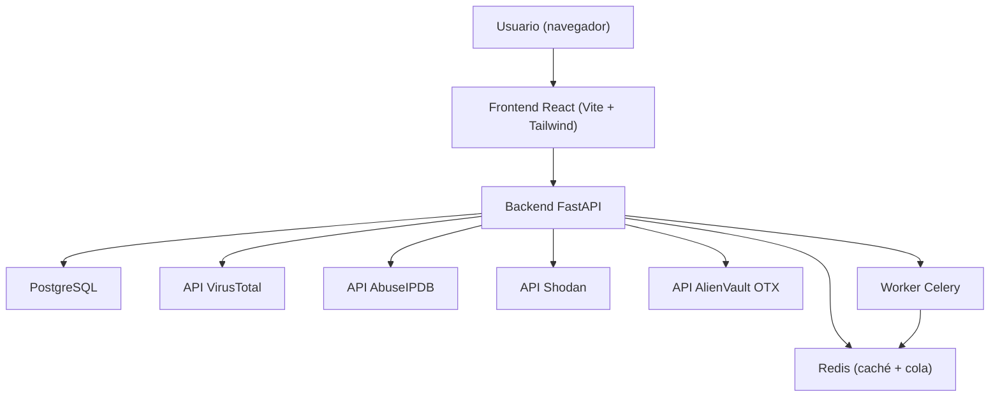

# Arquitectura — IOC Correlator

## Diagrama del sistema

## Por qué estas tecnologías

- **FastAPI** — soporte async nativo, ideal para consultas paralelas a fuentes de TI
- **PostgreSQL** — ACID y aislamiento multi-tenant por `tenant_id`
- **Redis** — caché (TTL ~1 h por IOC) y broker de Celery para trabajos por lotes
- **React + Tailwind** — UI accesible y componentes reutilizables
- **Fernet** — cifrado simétrico auditable para claves API en reposo

## Flujo de datos (IOC individual)

1. El usuario envía un IOC desde el frontend.
2. El backend detecta el tipo (IP, dominio, URL, hash).
3. Se consulta la caché Redis por tenant; si no hay hit, se llaman en paralelo las APIs configuradas.
   - Sin claves API no se escribe en caché; al añadir/quitar una clave se invalida `ioc:{tenant_id}:*`.
4. Se agregan puntuaciones (pesos 40/30/20/10) y se mapea severidad.
5. Se persiste en `analyses` y se devuelve al cliente.

## Despliegue

Ver [[Installation]] y [[Deployment]] para `install.sh`, Docker Compose y variables de entorno.

## Notas relacionadas

- [[Auth-Flow]]
- [[Database-Schema]]
- [[API-Integrations]]
- [[Deployment]]
