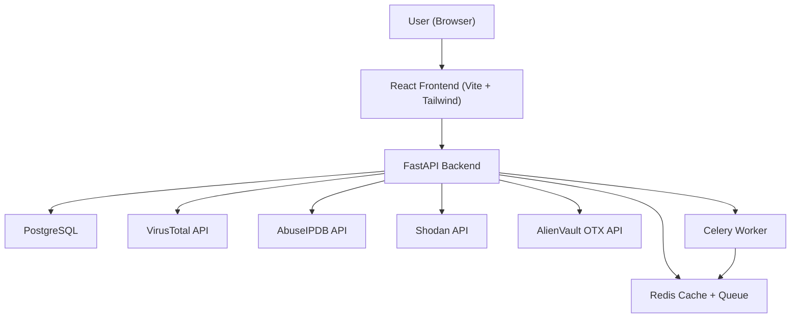

---
tags: [architecture, overview]
---

# Architecture — IOC Correlator

## System Diagram

```mermaid
graph TD
  User["User (Browser)"] --> Frontend["React Frontend (Vite + Tailwind)"]
  Frontend --> Backend["FastAPI Backend"]
  Backend --> PG["PostgreSQL"]
  Backend --> Redis["Redis Cache + Queue"]
  Backend --> VT["VirusTotal API"]
  Backend --> AB["AbuseIPDB API"]
  Backend --> SH["Shodan API"]
  Backend --> OTX["AlienVault OTX API"]
  Backend --> Celery["Celery Worker"]
  Celery --> Redis
```

## Related Notes

- [[Auth-Flow]]
- [[Database-Schema]]
- [[API-Integrations]]
- [[Deployment]]
