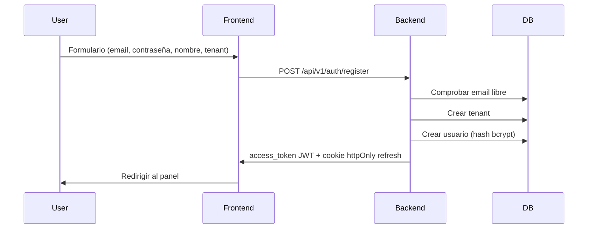
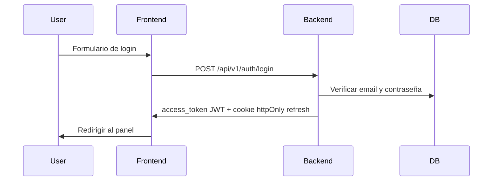

# Flujo de autenticación

## Secuencia de registro

## Secuencia de inicio de sesión

## Refresco de token

- El access token expira en 30 minutos (configurable con `ACCESS_TOKEN_EXPIRE_MINUTES`).
- Ante un 401, el frontend llama a `POST /api/v1/auth/refresh` con la cookie httpOnly.
- El backend valida el refresh en BD, lo rota y emite un nuevo access token.
- El refresh token sigue siendo de 7 días (`REFRESH_TOKEN_EXPIRE_DAYS`).

## Cierre de sesión

- `POST /api/v1/auth/logout` revoca el refresh token y borra la cookie.

## Multi-tenancy

- Cada modelo de negocio incluye `tenant_id`.
- Todas las consultas del usuario autenticado filtran por `current_user.tenant_id`.
- No hay fugas entre tenants a nivel ORM si se usan las dependencias estándar.

## Notas relacionadas

- [[Database-Schema]]
- [[Architecture]]
