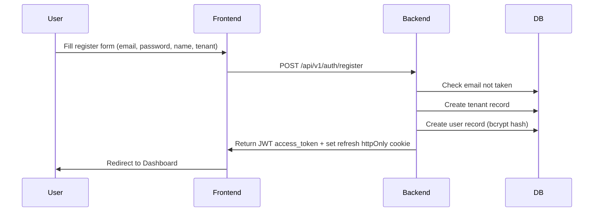
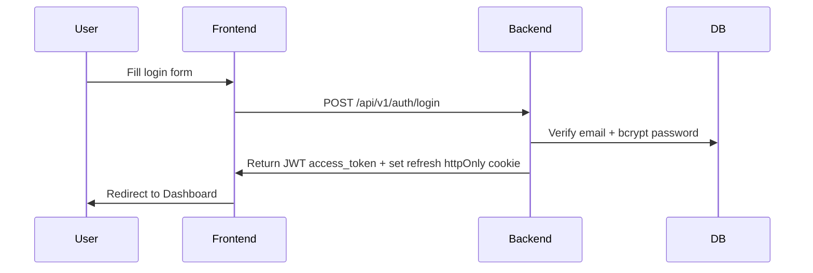

# Auth Flow

## Register Sequence

## Login Sequence

## Token Refresh

- Access token expires in 15 minutes (configurable)
- On 401, frontend calls `POST /api/v1/auth/refresh` using the httpOnly cookie
- Backend validates refresh token row, rotates refresh token, issues a new access token

## Multi-Tenancy

- Every protected query is scoped by `tenant_id` from the authenticated user
- API keys and analyses are isolated per tenant

## Related Notes

- [[Database-Schema]]
- [[Architecture]]
